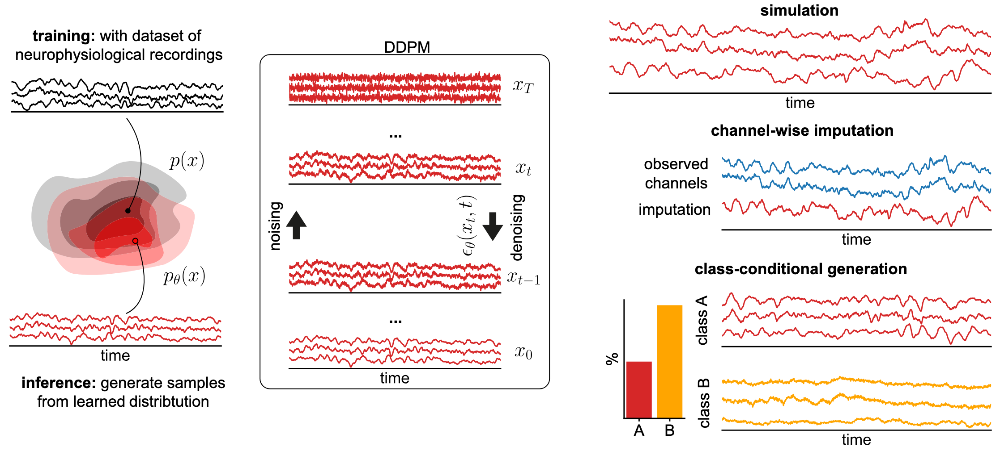

# Generating realistic neurophysiological time series with denoising diffusion probabilistic models



Code for the paper ["Generating realistic neurophysiological time series with denoising diffusion probabilistic models"](https://www.cell.com/patterns/fulltext/S2666-3899(24)00189-2), (2024).

The repository contains all the scripts to run the experiments presented in the paper.  
To run the experiments, first download the datasets (links in the paper) and change the `filepath` parameter in the dataset configuration files in `conf/dataset`. To save all outputs locally, set the `save_path` parameter in `conf/base` to the desired location.

Experiment tracking and saving with [Weights & Biases](https://wandb.ai/site) is also supported, but disabled by default.  
Finally, use the shell scripts provided in `scripts` to run the experiments! 

Additionally, an example Jupyter notebook `example_ner_notebook.ipynb`, where a diffusion model is trained to generate the BCI Challenge @ NER 2015 data, is provided together with the data.

## Installation
Install dependencies via pip:
```shell
git clone https://github.com/mackelab/neural_timeseries_diffusion.git
cd neural_timeseries_diffusion
pip install -e .
```

## Further information

#### How can apply the DDPM to my datasets?
This requires writing a dataloader for your dataset. Example dataloaders (for all the datasets used in paper) can be found in 
`datasets.py`.

A new dataloader, `FIFDataLoader`, is available for loading MNE Epochs directly from `.fif` files. This is particularly useful if your data is already in this standard MNE format.

The `FIFDataLoader` can also be a valuable tool for data augmentation. For instance, if you have unbalanced classes in your dataset, you can use this loader in conjunction with the diffusion model to generate synthetic data for specific subjects or classes, helping to balance your training set.

It supports:
*   **Unconditional generation**: Generating new data without any specific conditions.
*   **Conditional generation**: Generating data conditioned on `subject_id` and/or `class_label`.

To use `FIFDataLoader`, you would typically define it in a dataset configuration YAML file (e.g., within the `conf/dataset/` directory). Here's an example of how you might configure it:

```yaml
# Example configuration for FIFDataLoader in your_dataset_config.yaml
_target_: ntd.datasets.FIFDataLoader
file_path: /path/to/your/eeg_data/  # Can be a directory of .fif files or a single .fif file
n_epochs: 20  # Number of epochs to use from each subject/file
condition_on_subject_id: True  # Set to True to condition on subject ID
condition_on_class_label: True # Set to True to condition on class label

# If condition_on_class_label or condition_on_subject_id is True,
# filenames are expected to follow a convention like: CLASSLABEL_SUBJECTID_restofthefilename.fif
# For example: PATIENT_S001_run1_eeg.fif or CONTROL_S002_day3_eeg.fif
```

Key parameters:
*   `_target_`: Should be `ntd.datasets.FIFDataLoader`.
*   `file_path`: Path to your data. This can be a path to a single `.fif` file or a directory containing multiple `.fif` files.
*   `n_epochs`: The number of epochs to load from each `.fif` file (e.g., from each subject).
*   `condition_on_subject_id`: A boolean (`True` or `False`). If `True`, the dataloader will attempt to extract subject IDs from filenames.
*   `condition_on_class_label`: A boolean (`True` or `False`). If `True`, the dataloader will attempt to extract class labels from filenames. For this to work, filenames should follow a convention like `CLASSLABEL_SUBJECTID_*.fif`. The dataloader will then make these labels available for conditional modeling.

Make sure your `.fif` files contain epoch data that is compatible with the expected input of the model (e.g., consistent number of channels and time points). The `FIFDataLoader` expects 19 channels and 1000 time points per epoch (5 seconds at 200Hz) by default, and will warn if these are not met.

#### What options exist for the denoiser architectures?
Two denoiser different denoiser architectures based on [structured convolutions](https://arxiv.org/abs/2210.09298) are provided, differing only in the way conditional information is passed to the network. 

In general, the architecture using adaptive layer norm (`AdaConv`) is preferable and a good first choice over the one where conditional information is just concatenated (`CatConv`) (see [this paper](https://arxiv.org/abs/2212.09748) for a comparison of both approaches for an image diffusion model).

#### White noise vs. OU process
The standard white noise is a good initial choice. However, using the OU process can improve the quality of the generated power spectra. This requires setting the length scale of the OU process as an additional hyperparameter in the `diffusion_kernel` config files.

## Running the experiments
After downloading the datasets and updating the file paths, run the experiment shell scripts:
```shell
cd scripts
./<name_of_script>.sh
```
This produces result files which can then be passed to the plotting notebooks.